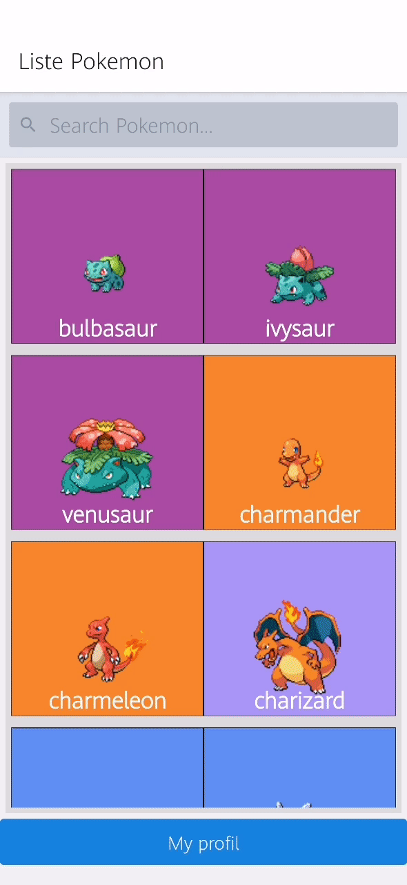

# Pokedex Mestrie Esteban

First react native project,
Creation of a Pokedex with [PokéApi](https://pokeapi.co/)

## Installation

```bash
git clone
npm install
```
Add your firebase config key on firebase.js

## Usage
```bash
yarn start
expo start
```

## list Pokemon :  


## Connexion Pokemon :  


## detail Pokemon :  


## search Pokemon :  


## fav Pokemon :  


