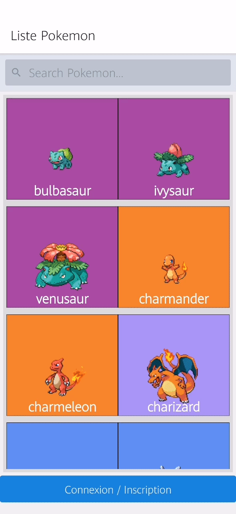

# Pokedex Mestrie Esteban

First react native project,
Creation of a Pokedex with [PokéApi](https://pokeapi.co/)

## Installation

```bash
git clone
npm install
```
Add your firebase config key on firebase.js

## Usage
```bash
yarn start
expo start
```

## Exercise
[https://github.com/makiboto/react-native-pkdx](https://github.com/makiboto/react-native-pkdx)

## Demonstration
list Pokemon :  

connexion :  

Deatail Pokemon :  

Search Pokemon :  

Fav Pokemon :  


